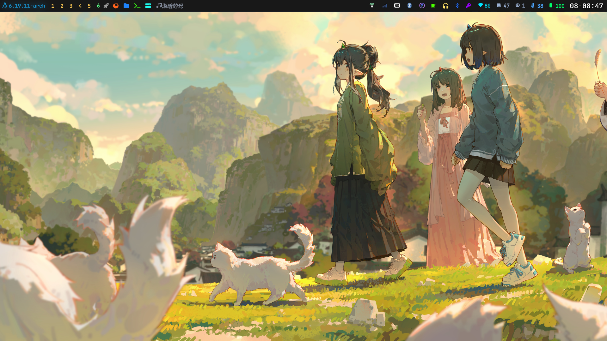
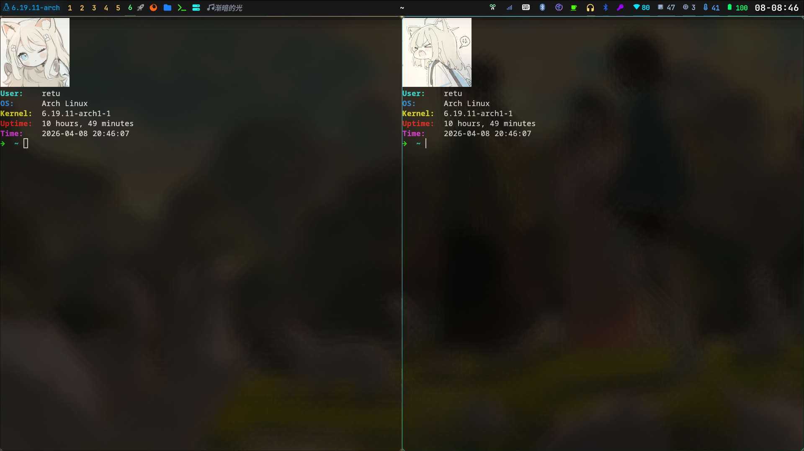

# 配置arch，使用hyprland+waybar+fish
## Installation

```shell
git clone https://github.com/retu20050219-ship-it/arch-setup
chmod +x install.sh
./install.sh
```

## 配置展示




### 其他配置
#### 应用启动器
应用起动器可以使用Aditya Shakya大佬的rofi配置https://github.com/adi1090x/rofi

#### sddm
sddm的美化使用Keyitdev大佬的配置https://github.com/Keyitdev/sddm-astronaut-theme

#### GRUB
grub的美化使用Vince大佬的配置https://github.com/vinceliuice/grub2-themes

